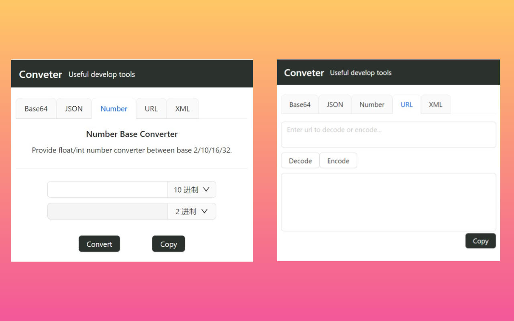
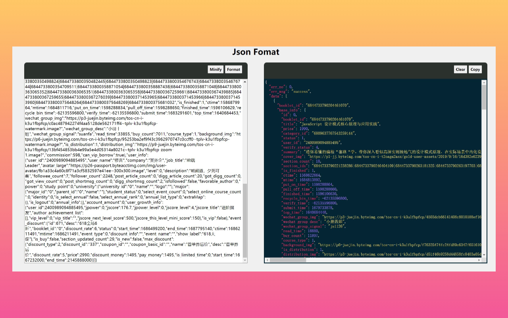
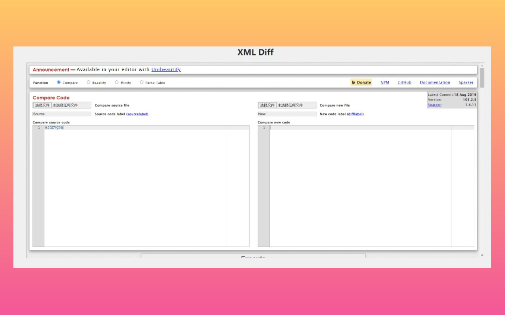

# Convertor
A combine tool set of XML/Json format/diff, Base64/URL en/decode etc... 
Save engineers' time from endless manual en/decode/diff job.

## Install
> [Click here to install](https://chrome.google.com/webstore/detail/parse-diff-tool/plldopcffknjbimajdlcakmlgimfofcf?hl=zh)

## Feature

## Contribute
1. `git clone`
2. `yarn` or `yarn install`
3. `yarn build`
4. `yarn lint` 
5. `yarn test`

## CHANGELOG
### 2023-06-15 - v1.1.2.0
- Fix: Decode complex URL
- PR: https://github.com/hj24/Convertor/pull/17

### 2023-04-24 - v1.1.1.1
- Enhancement: iframe loading
- PR: https://github.com/hj24/Convertor/pull/13

### 2023-04-11 - v1.1.0.4
- Feature: Number base conversion
- PR: https://github.com/hj24/Convertor/pull/10

### 2023-03-29 - v1.0.0.1 
- Bug fix: https://github.com/hj24/Convertor/issues/5
